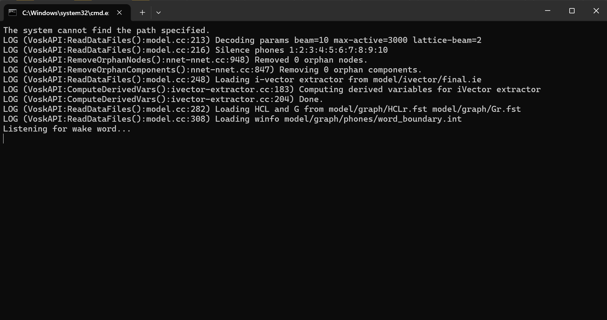
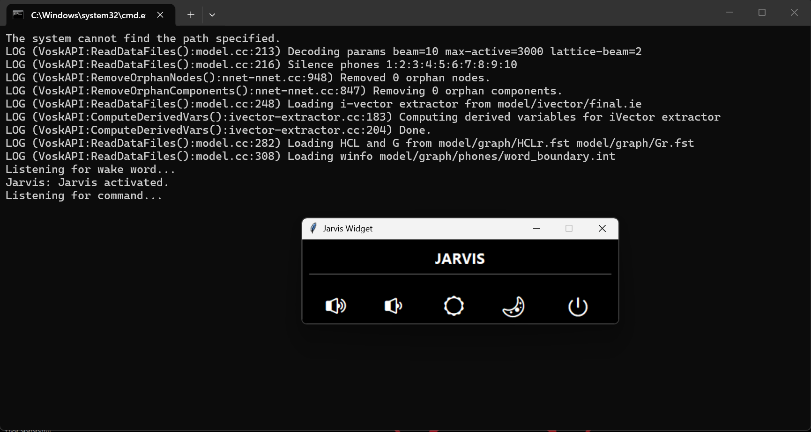
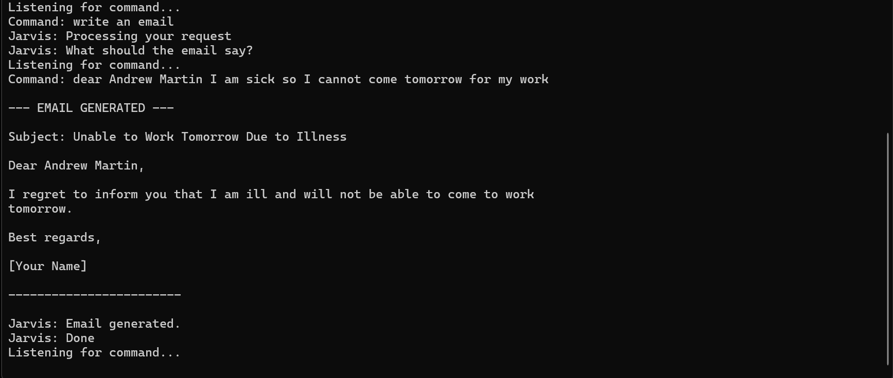
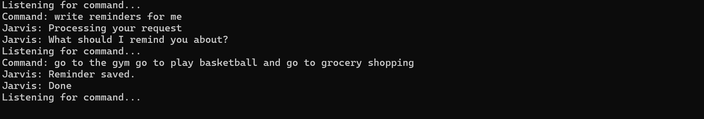
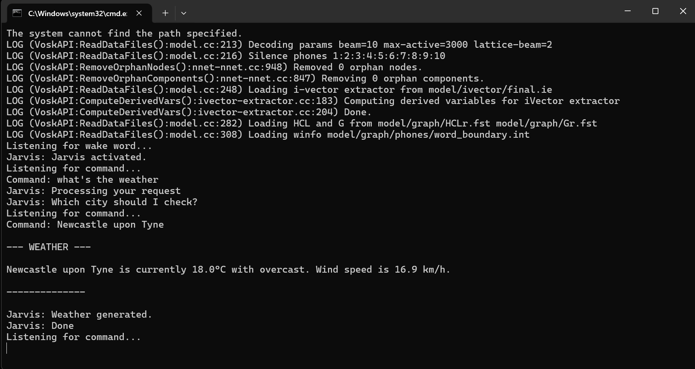

# Jarvis Assistant
Jarvis is a voice controlled personal assistant for Windows, built in Python. It is designed to be practical, responsive and easy to use, combining offline wake word detection, online speech recognition and AI powered features to help with everyday tasks on your PC.

Jarvis focuses on being:
- Lightweight: Minimal UI, small on-screen widget, voice first interaction.
- Practical: Controls system settings, opens apps, searches YouTube.
- Extendable: AI features such as email writing and reminders using Phi 3.

## Features

### 1. Speech System
- Offline Wake Word Detection (Vosk): Jarvis listens for a wake word locally using the Vosk engine, ensuring activation happens without sending continuous audio to the cloud.
- Online Command Recognition (Google STT): After activation, Jarvis uses Google Speech to Text for accurate command recognition.

### 2. AI Powered Features (Phi 3 via Ollama)
#### AI Email (ai-email)
- You speak the content of the email.
- Jarvis rewrites it into a short, clear, polite email using Phi 3.
- The final email is displayed.

#### AI Reminder (ai-reminder)
- You say what you want to remember.
- Jarvis saves the reminder to a simple reminders.txt file.
- Confirms the reminder is stored.

#### Weather (ai-weather)

- You ask for the weather.
- Jarvis asks which city it should check.
- It fetches live temperature and conditions in degrees Celsius for the requested city and displays the result, then confirms that the weather has been generated.

### 3. System Controls

#### Volume
- Set specific levels: "set volume to 30 or volume to any specific level".
- Basic controls: "volume up", "volume down", "mute".

#### Brightness
- Set specific levels: "set brightness to 50 or brightness to any specific level".
- Basic controls: "brightness up", "brightness down".

#### Power
- "shutdown"
- "restart"
- "lock"

### 4. Application & Browser Control

#### Open Apps
- open notepad
- open chrome
- open edge
- open youtube
- open settings
- open task manager

#### Close Apps
- close chrome
- close edge
- close youtube
- close settings
- close task manager

### 5. YouTube Integration

#### Search
- search funny cat videos on youtube.
- search song by [artist].

#### Play
- play [song] on youtube.
- play [song] song on youtube.

Jarvis uses the browser to open YouTube with the requested search or video.

### 6. On Screen Widget
A small Tkinter widget provides:
- Quick visual feedback
- Simple controls
- A minimal interface without a full application window

## Jarvis in Action

### Wake Word Detection

### Jarvis Activation and Widget

### AI-Email Generation

### AI-Reminder

### AI-Weather

## Architecture Overview

### Core Components
#### 1. Speech Recognition:
- Vosk - offline wake word detection
- Google STT - command recognition

#### 2. Audio I/O:
- PyAudio - microphone input
- pyttsx3 - text to speech output

#### 3. System Control:
- ctypes, WMI, OS - volume, brightness, power, app control

#### 4. UI:
- Tkinter - lightweight widget

#### 5. AI:
- Phi 3 via Ollama - email writing and reminders

#### 6. External Weather API (Open‑Meteo)
- live weather for any city

## Main Flow
1.	Wake Word Listening (Vosk): Jarvis continuously listens for a specific wake word.
2.	Activation When detected, Jarvis plays a prompt and begins listening for a command.
3.	Command Processing (process-command): The recognized text is analysed to determine whether it is:
- an AI command (email, reminder, weather)
- a system command (volume, brightness, power)
- an app or YouTube command or something else
4.	Execution: Jarvis runs the appropriate function (e.g., set-volume, open-chrome, ai-email) and provides visual feedback.

## Key Functions
### process_command(command)
#### Central command router that handles:
- System controls
- App open/close
- YouTube search/play
- AI email and reminders
- Fallback responses

### ai-email
- Prompts for email content
- Converts spoken text into a polished email using Phi 3
- Displays the final written email.

### ai-reminder
- Prompts for reminder
- Saves reminder to file
- Confirms completion

## Design Goals
- Practical First: Focused on real everyday tasks rather than flashy features.
- Simple to Understand: Clear command structure, readable functions, minimal UI.
- Easy to Extend: New AI features (explain, summarise, translate) can be added by creating new AI functions and updating process-command.

## Future Improvements
### Planned enhancements include:
1. Additional AI modes to explain concepts, summarise text, rewrite content in different tones, improved error handling, customisable wake word and commands and enhanced weather features (forecasts, alerts, default city).
2. Jarvis will also get more system controls, such as managing windows, checking network and battery status, turning Wi‑Fi or Bluetooth on and off, taking screenshots, handling files and folders and more.

3. A major upcoming milestone for this project is the integration of Jarvis with Cyber Shield X, a cybersecurity analysis tool. The goal is to allow Jarvis to run, manage and interpret Cyber Shield X scans through voice commands, creating a unified AI powered security assistant.
This integration will enable:
- Voice activated cybersecurity scans.
- Automated analysis by Cyber Shield X.
- Real time risk explanations in simple language by Jarvis.
- A single assistant capable of both productivity and security tasks.
##### (This combined system is part of the long term commercial vision for Jarvis)

## Development Status
Jarvis is currently under active development. The full source code will be released in a future version once the assistant reaches a stable public build.

## Source Code Availability
The complete implementation is intentionally not included at this stage to protect ongoing development and intellectual property. This repository serves as a technical overview and documentation of the project.
